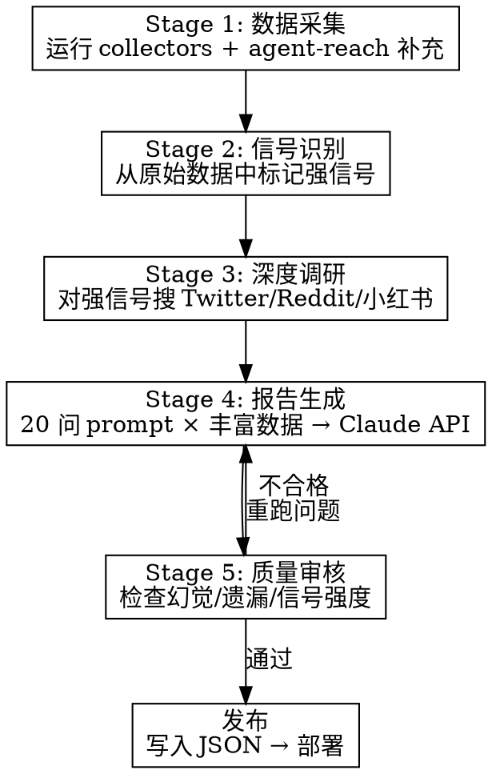

# BuilderPulse 每日调研工作流

> 5 阶段情报采集 → 信号识别 → 深度调研 → 报告生成 → 质量审核

## 工作流总览



## Stage 1: 数据采集（~5 分钟）

**目标**：获取今日全部原始数据

1. 运行 Python collectors（并行）：
```bash
cd ~/Movies/builderpulse
python collectors/hn.py > data/raw/$(date +%Y-%m-%d)/hn.json
python collectors/github_trending.py > data/raw/$(date +%Y-%m-%d)/github.json
python collectors/producthunt.py > data/raw/$(date +%Y-%m-%d)/producthunt.json
python collectors/google_trends.py > data/raw/$(date +%Y-%m-%d)/trends.json
python collectors/huggingface.py > data/raw/$(date +%Y-%m-%d)/huggingface.json
```

2. 用 agent-reach 补充 collectors 覆盖不到的数据：
   - 搜 Twitter/X: `"indie hacker" OR "side project" OR "Show HN" 过去24小时`
   - 搜 Reddit: `r/SideProject + r/startups 热帖`
   - 搜小红书: `独立开发 OR 副业项目`（如果面向中文读者）

3. 检查点：每个数据源至少有有效输出。缺失的标记为 `⚪ 不可用`

## Stage 2: 信号识别（~3 分钟）

**目标**：从海量数据中快速标记今日"强信号"

读取所有原始数据，用以下规则识别强信号：

| 信号类型 | 判断标准 |
|---------|---------|
| HN 爆帖 | 分数 > 500 或 评论 > 200 |
| GitHub 爆发 | 周增 star > 5000 |
| PH 爆款 | 票数 > 300 |
| 趋势突变 | Google Trends 7天增长 > 200% |
| 争议事件 | 评论中负面情绪占比 > 40% |
| Solo founder | Show HN + 单人开发标识 |

输出：**今日 Top 10 强信号列表**，每条包含：
- 来源（HN/GitHub/PH/Trends）
- 标题/名称
- 关键数据（分数/star/票数）
- 初步分类（Discovery/Tech/Competitive/Trends/Action）

## Stage 3: 深度调研（~10 分钟）

**目标**：对 Top 10 强信号做交叉验证和深挖

对每个强信号：

1. **交叉验证**：同一个项目/话题是否在多个平台出现？
   - HN 热帖 → GitHub 是否也在 trending？
   - PH 产品 → Twitter 上有多少讨论？

2. **深挖上下文**：用 agent-reach 搜索：
   - 项目作者的 Twitter/博客
   - 竞品分析（类似产品有哪些？）
   - 中国市场视角（B站/小红书有无相关内容？）

3. **补充数据写入** `data/raw/{date}/deep_research.json`

## Stage 4: 报告生成（~5 分钟）

**目标**：生成 20 问完整报告

运行 analyzer：
```bash
python analyzer.py
```

或手动调用 Claude API，将 Stage 1-3 的丰富数据注入 20 个 prompt 模板。

**关键**：每个问题的 prompt 必须包含：
- 原始数据（Stage 1）
- 强信号标记（Stage 2）
- 深挖补充材料（Stage 3）

## Stage 5: 质量审核（~3 分钟）

**目标**：确保报告质量

读取生成的报告 `data/reports/{date}.json`，检查：

| 检查项 | 标准 | 不合格处理 |
|--------|------|-----------|
| 幻觉检测 | 提到的项目/数据能在原始数据中找到 | 删除无来源的描述 |
| 数据准确性 | star 数/分数/票数与原始数据一致 | 修正数字 |
| 信号强度 | 🟢🟢🟢 = 3个以上数据源交叉确认 | 降级信号强度 |
| 覆盖完整性 | 20 个问题全部有回答 | 重跑缺失的问题 |
| Takeaway 质量 | 每条 Takeaway 有具体可操作建议 | 重写空洞的 Takeaway |
| 中英对照 | 项目名/术语准确 | 修正翻译 |

## 发布

```bash
# 复制到网站
cp data/reports/{date}.json site/public/data/
# 更新索引
python -c "
import json, glob, os
reports = sorted(glob.glob('site/public/data/20*.json'), reverse=True)
dates = [os.path.basename(r).replace('.json','') for r in reports]
with open('site/public/data/index.json','w') as f:
    json.dump({'dates': dates}, f)
"
# 提交
git add data/reports/ site/public/data/
git commit -m "chore: daily report $(date +%Y-%m-%d)"
```

## 快速模式 vs 完整模式

| 模式 | 耗时 | 跳过 | 适用场景 |
|------|------|------|---------|
| **快速** | ~10 分钟 | Stage 3 深度调研 | 日常自动化 |
| **完整** | ~25 分钟 | 无 | 手动交互式调研 |

快速模式：`python run_daily.py`
完整模式：按 Stage 1-5 逐步执行，每步人工检查

## 常见问题

| 问题 | 解决 |
|------|------|
| pytrends 429 | 降级为 ⚪，用 HN 讨论趋势推断 |
| GitHub Trending 爬取失败 | 降级为 Search API |
| PH 无 token | 输出空数组，跳过 PH 相关问题 |
| Claude API 超时 | analyzer.py 支持断点续跑 |
| 某个问题回答质量差 | Stage 5 标记后单独重跑该问题 |
